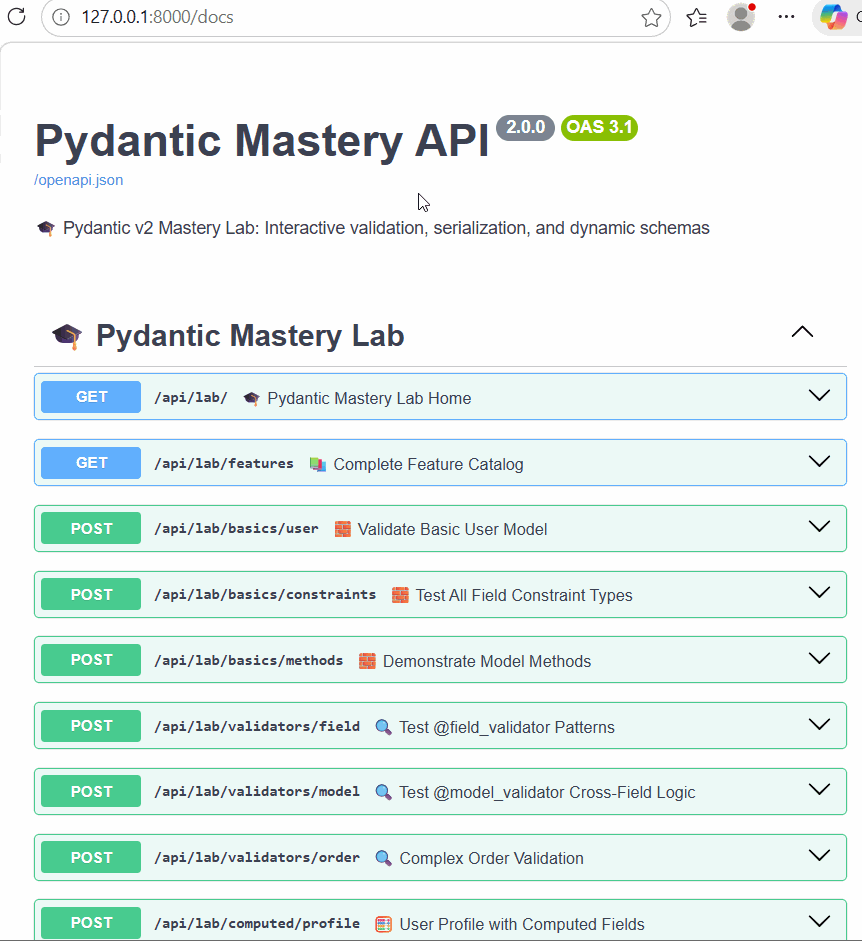

# 🎓 Pydantic v2 Mastery Lab

> **A production-grade FastAPI application demonstrating every advanced Pydantic v2 feature.**  

[](https://www.python.org/downloads/)
[](https://fastapi.tiangolo.com/)
[](https://docs.pydantic.dev/latest/)
[](LICENSE)

---
## 🚀 Quick Start

```bash
# 1. Clone & setup
git clone <your-repo-url>
cd pydantic-mastery
python -m venv .venv && source .venv/bin/activate  # Windows: .venv\Scripts\activate

# 2. Install dependencies
pip install -r requirements.txt

# 3. Run server
uvicorn app.main:app --reload --host 127.0.0.1 --port 8000

# 4. Open interactive docs
open http://127.0.0.1:8000/docs  # Mac
start http://127.0.0.1:8000/docs # Windows
```

---

## 📁 Project Architecture

```
pydantic-mastery/
├── README.md                 # You are here
├── requirements.txt          # Python dependencies
├── app/
│   ├── main.py              # FastAPI entrypoint, middleware, wiring
│   ├── core/
│   │   ├── config.py        # Pydantic Settings, env overrides, SecretStr
│   │   └── exceptions.py    # Structured error handlers, request ID tracing
│   ├── middleware/
│   │   └── request_id.py    # Async middleware for correlation IDs
│   ├── models/              # 11 focused Pydantic v2 feature files
│   ├── routes/
│   │   └── pydantic_lab.py  # 50+ learning & playground endpoints
│   ├── services/            # Optional: typed JSON storage (future)
│   └── data/
│       ├── data.json        # Production-like test records
│       └── playground_examples.json # Valid/invalid payloads for UI
├── tests/                   # pytest suite: models, routes, middleware
└── docs/                    # (Optional) Static documentation output
```

---

## Demo of API with openapi:
 
 
## 🧠 Pydantic v2 Features Demonstrated

| Feature | File | Real-World Use Case |
|---------|------|---------------------|
| `BaseModel` & `Field()` constraints | `basics.py` | API contracts, form validation |
| `@field_validator(mode="before/after/wrap")` | `field_validators.py` | Email normalization, tag dedup, age rules |
| `@model_validator(mode="before/after")` | `model_validators.py` | Password matching, cross-field business logic |
| `@computed_field` | `computed.py` | Derived values, pricing breakdowns, status badges |
| `TypeAdapter` | `type_adapters.py` | Webhook validation, config files, batch imports |
| `ConfigDict` (strict, extra, aliases, frozen) | `strict_config.py` | Input hardening, JS/Python naming sync, immutability |
| `StrEnum`, `EmailStr`, `SecretStr`, `HttpUrl` | `enum_custom.py` | Role-based access, secure token handling, URL validation |
| `@field_serializer`, `include/exclude`, context | `serialization.py` | Public vs admin payloads, ORM sync, frontend optimization |
| `Annotated[T, ...]` pipelines | `annotated_advanced.py` | Reusable domain types, composable constraint chains |
| Recursive models & `Generic[T]` | `nested_generics.py` | Comment threads, org trees, paginated API responses |
| `Field(discriminator="...")` unions | `discriminated_unions.py` | Payment methods, webhook routing, search filters |

---

## 🎮 Interactive Playground Foundation

The `/lab/playground/*` endpoints are explicitly designed to power a future React/Vue frontend:

| Endpoint | Purpose | Frontend Integration |
|----------|---------|---------------------|
| `POST /lab/playground/validate?model=...` | Universal validator: any model + payload | Live validation with `field_errors` for inline editor highlighting |
| `GET /lab/playground/schema/{model}` | Export OpenAPI-compatible JSON Schema | Auto-generate TypeScript interfaces & dynamic forms |
| `GET /lab/playground/examples/{model}` | Return valid/invalid example payloads | "Try It" buttons with pre-filled test cases |
| `POST /lab/playground/compare` | Side-by-side validation (strict vs lenient) | Visual comparison of config impact on validation behavior |

**Example Playground Flow**:
1. User selects a model → fetches examples from `/playground/examples/{model}`
2. Edits JSON in a Monaco editor → submits to `/playground/validate`
3. API returns structured errors with `field_errors` keys → frontend highlights invalid fields
4. Success response includes computed fields & updated schema

---

## 🧪 Testing & Quality

```bash
# Run full test suite
pytest tests/ -v

# Run with coverage report
pytest tests/ --cov=app/models --cov-report=term-missing

# Watch mode for TDD
pip install pytest-watch
ptw
```

**Test Coverage**:
- ✅ Unit validation (constraints, validator modes, computed fields)
- ✅ Discriminator union routing & batch validation
- ✅ Structured error formatting & request ID propagation
- ✅ Endpoint integration & schema export
- ✅ Middleware request ID generation/passthrough

---

## 🛠️ Tech Stack

| Layer | Tool | Purpose |
|-------|------|---------|
| Framework | FastAPI 0.115+ | Async routing, auto OpenAPI, dependency injection |
| Validation | Pydantic 2.x | Type-safe models, modern validators, JSON schema |
| Config | `pydantic-settings` | Env loading, secret masking, environment overrides |
| Testing | `pytest` + `httpx` | Async test client, validation assertions |
| Docs | Swagger UI / ReDoc | Interactive API explorer, try-it payloads |

---


This project demonstrates **expert-level Pydantic v2 mastery** with production-ready patterns:

1. **Strict Validation Pipelines**: `mode="before/after/wrap"` replaces fragile legacy validators
2. **Composable Constraints**: `Annotated[T, metadata]` creates reusable, DRY validation rules
3. **Type-Safe Routing**: `Field(discriminator=...)` replaces `if/else` with auto-validated unions
4. **Structured Errors**: Frontend-ready `field_errors` mapping with contextual tips
5. **Context-Aware Serialization**: One model → public API / admin view / frontend payload
6. **Runtime Validation**: `TypeAdapter` handles webhook/plugin configs without static models

**How to see demo**:
- Open `/docs` → click "Try it out" on any endpoint
- Show `/lab/playground/compare` to demonstrate strict vs lenient behavior
- Point to `core/exceptions.py` to explain secure, structured error handling
- Export `/openapi.json` and show TypeScript generation for frontend sync

---

## 🗺️ Future Roadmap

- [ ] React/Next.js playground: Monaco JSON editor + live validation + error highlighting
- [ ] WebSocket/SSE endpoint for real-time validation feedback
- [ ] GitHub Actions CI: `pytest`, `ruff`, `mypy`, coverage threshold
- [ ] OpenAPI TypeScript client generator (`quicktype` / `openapi-generator`)
- [ ] Rate limiting & caching for `/lab/playground/*` endpoints

---

## 🤝 Contributing

1. Fork the repository
2. Create a feature branch: `git checkout -b feature/amazing-feature`
3. Commit changes: `git commit -m 'Add amazing feature'`
4. Push to branch: `git push origin feature/amazing-feature`
5. Open a Pull Request

**Code Standards**:
- Follow PEP 8 for Python style
- Add docstrings to all public functions/classes
- Include tests for new features
- Keep validation logic isolated in `app/models/`

---

## 📄 License

MIT License. See [LICENSE](LICENSE) for details.

---

> **Built with ❤️ for developers who believe type safety shouldn't slow them down.**  
> *Questions? Open an issue or reach out directly.*